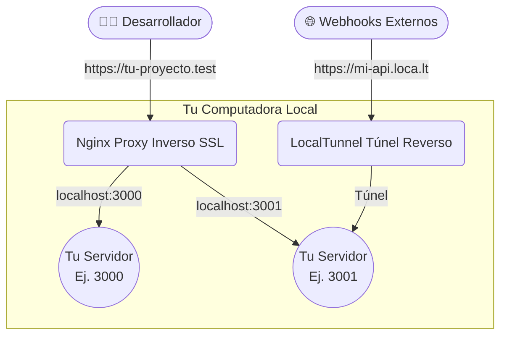

# Magicserve 🪄

*[Read in English](README.md)*

Magicserve es una herramienta CLI para gestionar entornos de desarrollo web locales. Levanta automáticamente un Reverse Proxy (Nginx) con HTTPS para múltiples servicios locales a la vez, genera certificados SSL vía `mkcert` y le asigna a cada uno un dominio dinámico (ej. `tu-proyecto.test`), además de URLs públicas opcionales vía `localtunnel`.

> **Tú levantas tus propios servidores.** Magicserve **no** inicia ni detiene tus apps. Tú levantas lo que quieras (Node, PHP, Python, Go, …) en los puertos que listes en `magicserve.json`, y Magicserve enlaza el dominio HTTPS, el certificado y el túnel a ese puerto.

## Requisitos

Antes de utilizar `magicserve`, es necesario tener instalado en la computadora de desarrollo:
- [Node.js y npm](https://nodejs.org/)
- [jq](https://jqlang.github.io/jq/) (`brew install jq`)
- [mkcert](https://github.com/FiloSottile/mkcert) (`brew install mkcert`)
- Nginx (`brew install nginx`)
- PHP (si tu proyecto requiere servicios backend en php)

## Instalación global

Si tienes los requisitos instalados, puedes instalar la utilidad de manera global desde npm:

```bash
npm install -g magicserve
```

## Actualización

Si ya tienes `magicserve` instalado y quieres actualizarlo a la última versión, ejecuta:

```bash
npm update -g magicserve
```

Tus archivos `magicserve.json` en tus proyectos **no se verán afectados**.

> 💡 Puedes verificar la versión instalada ejecutando cualquier comando de `magicserve`, aparecerá al inicio.

## ¿Cómo se usa?

Una vez instalado de manera global, dirígete a cualquier carpeta en tu computadora que servirá como "nodo central" o "espacio de trabajo" de tus proyectos, y ejecuta:

```bash
magicserve init
```

Este comando creará automáticamente un archivo base llamado **`magicserve.json`** en el directorio actual. 

### Archivo de configuración: `magicserve.json`

Tu directorio central mapea dominios a los puertos locales de las apps que tú mismo levantas. Su estructura es así de sencilla:

```json
[
    {
        "domain": "tu-proyecto.test",
        "port": 3000
    },
    {
        "domain": "api.tu-proyecto.test",
        "port": 3001,
        "tunnel": "mi-super-api-dev"
    }
]
```

**Propiedades:**
- **`domain`**: El dominio de desarrollo local que se enlazará automáticamente (eg. `*.test`).
- **`port`**: El puerto local donde está escuchando **tu** servidor. Magicserve hace proxy del dominio a `localhost:<port>`; tú eres responsable de levantar ese servidor.
- **`tunnel`**: *(Opcional)* Subdominio para exponer tu puerto a internet público a través de `localtunnel` (Ej. webhooks de Mercado Libre o pruebas móviles). Usa `true` para un subdominio aleatorio.

Una vez configurado a tu gusto, levanta tus propios servidores en esos puertos y utiliza los comandos de control.

## Comandos disponibles

## Arquitectura: ¿Cómo funciona bajo la manga?

Magicserve orquesta en segundos varias herramientas subyacentes para que tú solo te preocupes por el código de tu proyecto.



> Magicserve gestiona las partes de infraestructura (proxy Nginx, SSL, hosts, túnel). Los servidores detrás de los puertos los inicias y detienes tú.

Dentro del directorio donde está tu `magicserve.json`, dispones de los siguientes comandos mágicos:

- **`magicserve start`**: Para cada dominio genera el certificado SSL si hace falta, agrega la entrada en `/etc/hosts`, escribe el proxy HTTPS de Nginx hacia `localhost:<port>` y abre los túneles configurados. (Levanta tus servidores antes o después — Magicserve no los inicia.)
- **`magicserve stop`**: Quita los proxys de Nginx y las entradas de `/etc/hosts` y cierra los túneles de los dominios de tu `magicserve.json`. Tus servidores siguen corriendo.
- **`magicserve status`**: Te muestra si hay un servidor escuchando en el puerto de cada dominio, más el estado y la URL pública de los túneles.
- **`magicserve stopall`**: Comando de emergencia. Destruye TODAS las configuraciones de proxy de Nginx, túneles, certificados SSL y entradas custom de `localhost` en todo el sistema, restaurando tu computadora. (Ya no mata tus servidores de apps — esos los gestionas tú.)

---

### Novedades en v2.0.0 🔌 (Breaking)

- **Tú levantas tus propios servidores.** Magicserve ya no inicia procesos `node`/`php` — solo configura el proxy HTTPS de Nginx, el certificado SSL, la entrada en `/etc/hosts` y el túnel opcional apuntando al puerto que tú levantas (funciona con **cualquier** stack: Node, PHP, Python, Go, …).
- **Config más simple.** `magicserve.json` ahora solo lleva `domain` + `port` (+ `tunnel` opcional). Se eliminaron las propiedades `path` y `type`.
- **`stop` no afecta a tus apps.** Solo retira el proxy y los túneles; tus servidores siguen corriendo.
- **`status` revisa el puerto.** Ahora reporta si hay algo escuchando en cada puerto (vía `lsof`) en lugar de rastrear el PID de un servidor.
- **`stopall` ya no mata tus servidores de apps** (esos los gestionas tú); sigue purgando todos los proxys, túneles, certificados y entradas custom de `hosts`.

> **Migrar desde v1.x:** elimina `path` y `type` de cada entrada de tu `magicserve.json`, y levanta tus servidores tú mismo antes/después de ejecutar `magicserve start`.

### Novedades en v1.2.0 🚇

- **Localtunnel Integrado**: Expón de forma permanente y automática puertos de tu API al internet vía la nueva propiedad `tunnel` en el config json para recibir **Webhooks** de terceros (Mercado Libre, Stripe, etc).

### Novedades en v1.1.0 🚀

- **Visualización de Versión**: Ahora puedes ver la versión de Magicserve directamente en la terminal al ejecutar cualquier comando.
- **Soporte para Archivos Grandes**: Nginx y PHP se configuran automáticamente para soportar payloads de hasta **100MB** (uploads y JSON), solucionando el error "413 Request Entity Too Large".
- **SSL Automático**: Soporte nativo para HTTPS vía `mkcert`.
