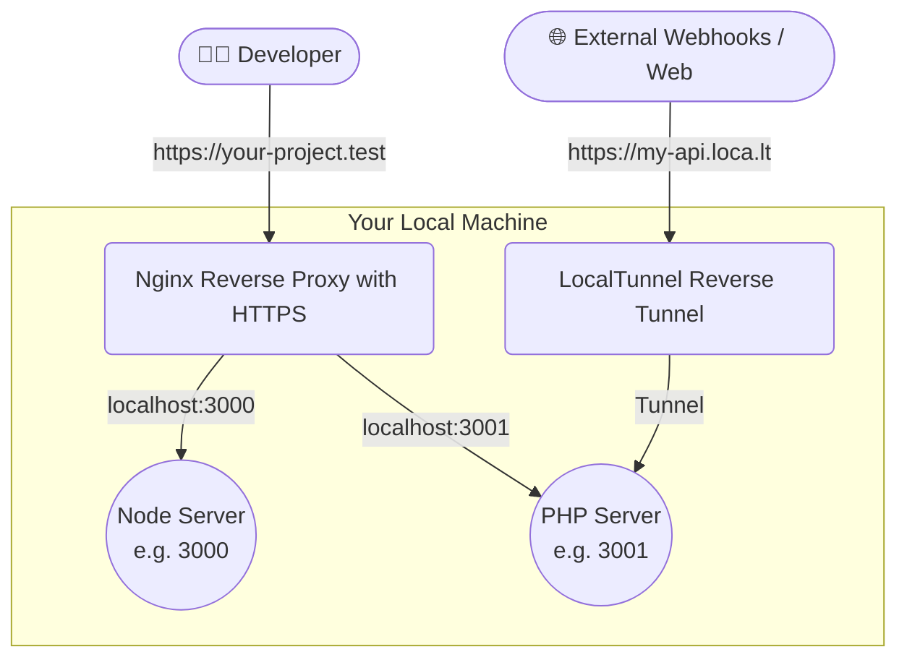

# Magicserve 🪄

*[Leer en Español](README.es.md)*

Magicserve is a CLI tool for managing local web development environments. Its goal is to start, stop, and manage the state of multiple local servers (`node` and `php`) simultaneously, automatically set up a Reverse Proxy (Nginx), and generate SSL certificates via `mkcert` to assign them a dynamic local domain (e.g. `your-project.test`).

## Requirements

Before using `magicserve`, you must have the following installed on your development machine:
- [Node.js and npm](https://nodejs.org/)
- [jq](https://jqlang.github.io/jq/) (`brew install jq`)
- [mkcert](https://github.com/FiloSottile/mkcert) (`brew install mkcert`)
- Nginx (`brew install nginx`)
- PHP (if your project requires a PHP backend service)

## Global Installation

If you have the requirements installed, you can globally install the utility from npm:

```bash
npm install -g magicserve
```

## Updating

If you already have `magicserve` installed and want to update to the latest version, simply run:

```bash
npm update -g magicserve
```

Your `magicserve.json` files in your projects **will not be affected**.

> 💡 You can verify the installed version by running any `magicserve` command — it will be displayed at the top.

## How to Use

Once installed globally, navigate to any folder on your computer that will serve as a "central hub" or "workspace" for your projects, and run:

```bash
magicserve init
```

This command will automatically create a base **`magicserve.json`** file in the current directory. 

### Configuration File: `magicserve.json`

Your central directory manages and starts the applications referenced within the **`magicserve.json`**. Its structure is this simple:

```json
[
    {
        "path": "../your-frontend-project",
        "domain": "your-project.test",
        "type": "node",
        "port": 3000
    },
    {
        "path": "../your-backend-api",
        "domain": "api.your-project.test",
        "type": "php",
        "port": 3001,
        "tunnel": "my-cool-api-dev"
    }
]
```

**Properties:**
- **`path`**: Relative or absolute path to the project's directory where the server should run.
- **`domain`**: The local development domain that will be automatically mapped (e.g. `*.test`).
- **`type`**: `node` (Runs using `npm run dev`) or `php` (Runs the PHP built-in server using `php -S`).
- **`port`**: The internal port the service will use.
- **`tunnel`**: *(Optional)* Subdomain to securely expose your internal port to the public internet via `localtunnel` (Great for testing third-party Webhooks like Mercado Libre or local mobile testing).

Once configured or modified to your liking, you can use the control commands.

## Available Commands

## Architecture: How it works under the hood

Magicserve instantly orchestrates multiple local tools so you don't have to manage them manually.



Within the directory where your `magicserve.json` is located, you have the following magic commands available:

- **`magicserve start`**: Starts all services declared in `magicserve.json` on the defined ports, generates dynamic SSL certificates if necessary, and configures Nginx.
- **`magicserve stop`**: Orderly stops the active services mentioned in your `magicserve.json`.
- **`magicserve status`**: Shows a terminal output of which projects are currently active and their PIDs.
- **`magicserve stopall`**: Emergency command. Finds and destroys ALL active daemons, related Nginx configurations, certificates, processes, and purges all custom localhost entries system-wide, restoring your computer's clean state.

---

### Features in v1.2.0 🚇

- **Integrated Localtunnel**: Permanently and automatically expose any of your API ports to the internet via the new `tunnel` property in config JSON to seamlessly receive third-party **Webhooks** (Mercado Libre, Stripe, etc).

### Features in v1.1.0 🚀

- **Version Display**: Now you can see the Magicserve version directly in the terminal.
- **Large Body Support**: Nginx and PHP are automatically configured to support up to **100MB** payloads (JSON and file uploads), fixing the "413 Request Entity Too Large" error.
- **Automatic SSL**: Native support for HTTPS via `mkcert`.
