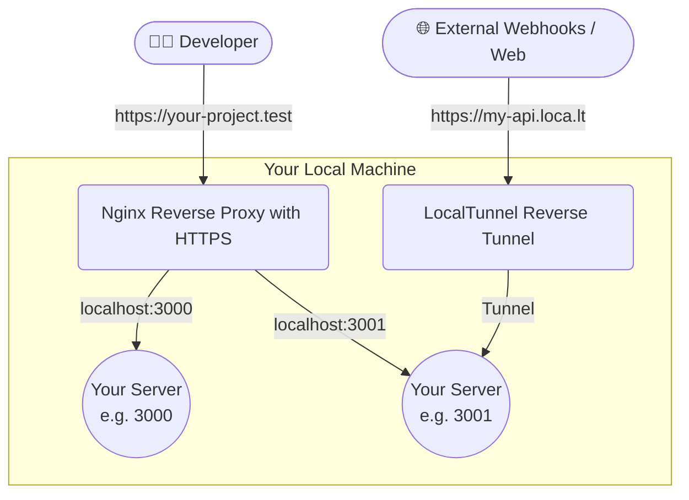

# Magicserve 🪄

> **Pretty `https://your-project.test` URLs for any local server — in one command.**

[](https://www.npmjs.com/package/magicserve)
[](https://www.npmjs.com/package/magicserve)
[](./LICENSE)
[-black?logo=apple)](#requirements)

*[Leer en Español 🇪🇸](README.es.md)*

Magicserve turns `localhost:3000` into a real, trusted, **HTTPS** domain like `https://your-project.test` — and optionally a **public URL** for webhooks — without you touching a single Nginx config, certificate, or `/etc/hosts` line.

You keep running your own servers (Node, PHP, Python, Go, Rust… anything). Magicserve wires the infrastructure around them.

```bash
npm install -g magicserve
magicserve init      # creates magicserve.json
magicserve start     # 🎉 https://your-project.test is live with valid SSL
```

---

## Why Magicserve?

Setting up local HTTPS the "manual" way means juggling `mkcert`, hand-writing Nginx `server` blocks, editing `/etc/hosts` as root, and spinning up a tunnel for every webhook test. Magicserve does all of that from a tiny JSON file:

| Without Magicserve | With Magicserve |
| --- | --- |
| `http://localhost:3001` 😪 | `https://api.your-project.test` 🔒 |
| Browser SSL warnings | Trusted certificate via `mkcert` |
| Hand-edit Nginx + `/etc/hosts` | One `magicserve.json` |
| Separate `ngrok`/`localtunnel` command per service | `"tunnel": "my-api"` in config |
| Different setup per stack | Same flow for **any** language |

- 🔒 **Trusted local HTTPS** — real SSL certs via `mkcert`, no browser warnings, no `--insecure`.
- 🌐 **Nice `.test` domains** — `https://your-project.test` instead of `localhost:3000`, even cookies & CORS behave.
- 🚇 **Public tunnels in one line** — expose a port to the internet for Stripe / Mercado Libre / WhatsApp webhooks or mobile testing.
- 🧩 **Stack-agnostic** — Magicserve never starts your servers, so it works with Node, PHP, Python, Go, Bun, Deno… whatever you run.
- ⚡ **Multi-service** — proxy your whole microservice constellation (`app.test`, `api.test`, `admin.test`) at once.
- 🧹 **One-command teardown** — `stop` cleans up just your project; `stopall` resets the whole machine.

## Requirements

macOS on Apple Silicon, with [Homebrew](https://brew.sh). Then install the dependencies:

```bash
brew install jq mkcert nginx
mkcert -install   # one-time: trust the local certificate authority
```

| Tool | Why it's needed |
| --- | --- |
| [Node.js & npm](https://nodejs.org/) | To install and run Magicserve |
| [jq](https://jqlang.github.io/jq/) | Parses your `magicserve.json` |
| [mkcert](https://github.com/FiloSottile/mkcert) | Generates trusted local SSL certificates |
| [Nginx](https://nginx.org/) | The HTTPS reverse proxy |

## Install

```bash
npm install -g magicserve
```

**Update** to the latest version anytime — your project `magicserve.json` files are never touched:

```bash
npm update -g magicserve
```

> 💡 Every command prints the installed version at the top, so you always know what you're running.

## Quick start

1. Go to any folder you want to use as your workspace hub and create the config:

   ```bash
   magicserve init
   ```

2. Edit the generated **`magicserve.json`** to map domains to the ports you'll run:

   ```json
   [
       {
           "domain": "your-project.test",
           "port": 3000
       },
       {
           "domain": "api.your-project.test",
           "port": 3001,
           "tunnel": "my-cool-api-dev"
       }
   ]
   ```

3. Start your own servers on those ports (e.g. `npm run dev`, `php artisan serve --port=3001`, …).

4. Wire up the HTTPS domains, certs and tunnels:

   ```bash
   magicserve start
   ```

   Now open **`https://your-project.test`** in your browser. 🔒

> `start`, `stop` and `stopall` edit `/etc/hosts` and reload Nginx, so they ask for your `sudo` password.

### Configuration: `magicserve.json`

A JSON array mapping domains to local ports. That's the whole API:

| Property | Required | Description |
| --- | --- | --- |
| `domain` | ✅ | The local dev domain to map (e.g. `your-project.test`). |
| `port` | ✅ | The port **your** server listens on. Magicserve proxies the domain to `localhost:<port>`. |
| `tunnel` | ⬜ | Expose the port publicly via `localtunnel`. Use a string for a fixed subdomain (`https://<string>.loca.lt`) or `true` for a random one. Perfect for third-party webhooks. |

## Commands

Run these from the directory that contains your `magicserve.json`:

| Command | What it does |
| --- | --- |
| `magicserve init` | Creates a starter `magicserve.json` in the current directory. |
| `magicserve start` | For each domain: generates the SSL cert (if needed), adds the `/etc/hosts` entry, writes the Nginx HTTPS proxy to `localhost:<port>`, and opens any configured tunnels. |
| `magicserve stop` | Removes the Nginx proxies, `/etc/hosts` entries and tunnels for the domains in **this** `magicserve.json`. Your servers keep running. |
| `magicserve status` | Shows whether something is listening on each domain's port, plus each tunnel's status and public URL. |
| `magicserve stopall` | 🧨 Emergency reset: destroys **all** Nginx proxy configs, tunnels, SSL certs and custom `localhost` entries system-wide. |

## How it works under the hood

Magicserve orchestrates several local tools in seconds so you only worry about your code.


```mermaid
flowchart TD
    Dev([👨‍💻 Developer])
    World([🌐 External Webhooks / Web])

    subgraph Your Local Machine
        Nginx(Nginx Reverse Proxy with HTTPS)
        LT(LocalTunnel Reverse Tunnel)
        Node((Your Server\ne.g. 3000))
        PHP((Your Server\ne.g. 3001))
    end

    Dev -- "https://your-project.test" --> Nginx
    World -- "https://my-api.loca.lt" --> LT

    Nginx -- "localhost:3000" --> Node
    Nginx -- "localhost:3001" --> PHP
    LT -- "Tunnel" --> PHP
```

> Magicserve manages the infrastructure (Nginx proxy, SSL, hosts, tunnel). The servers behind the ports are started and stopped by **you**.

## FAQ

**Does Magicserve start my app server?**
No — and that's intentional. You run any stack you like on the ports; Magicserve only wires the HTTPS domain, certificate and tunnel to them.

**Why `.test` domains?**
`.test` is a reserved TLD (RFC 6761) that will never resolve on the public internet, so it's the safe, conflict-free choice for local development.

**Is this an `ngrok` replacement?**
For the public-URL part, yes — the optional `tunnel` property gives you a public HTTPS URL via `localtunnel`, ideal for receiving webhooks (Stripe, Mercado Libre, WhatsApp…) or testing on a phone.

**Does it work on Linux / Windows / Intel Macs?**
Not yet. Magicserve currently assumes macOS on Apple Silicon with Homebrew paths. Contributions to broaden support are very welcome.

**I get an SSL warning.**
Run `mkcert -install` once to trust the local certificate authority, then `magicserve start` again.

## Contributing

The entire tool is a single Bash script (`run.sh`) — easy to read and hack on. Issues and PRs are welcome: [github.com/davidlomas/magicserve](https://github.com/davidlomas/magicserve).

## Changelog

### v2.0.0 🔌 (Breaking)

- **You run your own servers.** Magicserve no longer launches `node`/`php` processes — it only sets up the Nginx HTTPS proxy, SSL certificate, `/etc/hosts` entry and optional tunnel pointing at the port you bring up yourself (works with **any** stack).
- **Simpler config.** `magicserve.json` now takes only `domain` + `port` (+ optional `tunnel`). The `path` and `type` properties were removed.
- **`stop` is non-destructive to your apps.** It tears down the proxy and tunnels only; your servers keep running.
- **`status` probes the port.** It reports whether something is listening on each port (via `lsof`) instead of tracking a server PID.
- **`stopall` no longer kills app servers**; it still purges all proxies, tunnels, certificates and custom `hosts` entries.

> **Migrating from v1.x:** remove `path` and `type` from each entry in your `magicserve.json`, and start your servers yourself before/after running `magicserve start`.

### v1.2.0 🚇

- **Integrated Localtunnel**: expose any API port to the internet via the `tunnel` property to receive third-party **webhooks** (Mercado Libre, Stripe, etc).

### v1.1.0 🚀

- **Version display** in the terminal.
- **Large body support**: Nginx configured for up to **100MB** payloads, fixing "413 Request Entity Too Large".
- **Automatic SSL** via `mkcert`.

## License

[MIT](./LICENSE) © David Lomas
